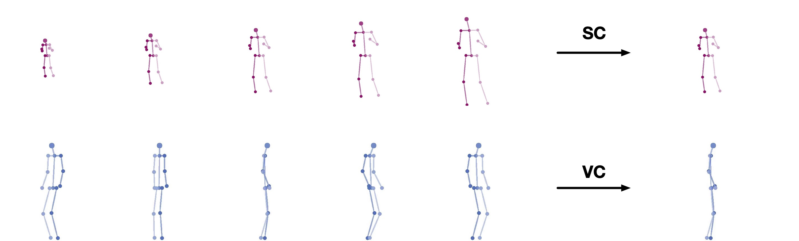

# MoCaNet: Motion Retargeting in-the-wild via Canonicalization Networks

This is the official PyTorch implementation of *MoCaNet: Motion Retargeting in-the-wild via Canonicalization Networks (AAAI 2022)*.

**[Paper](https://arxiv.org/abs/2112.10082) | [Project Page](https://yzhq97.github.io/mocanet/) | [Poster](https://yzhq97.github.io/assets/mocanet/poster.pdf)**




## Environment

```
conda install pytorch torchvision cudatoolkit=10.1 -c pytorch
conda install pyyaml scikit-image scikit-learn opencv
pip install -r requirements.txt
```

## Data

We use the Mixamo and SoloDancer datasets. Please refer to [TransMoMo](https://github.com/yzhq97/transmomo.pytorch#data) for detailed instructions.

## Training

for descriptions of training options, do
```shell script
python train.py --help
```

To train on Mixamo
```shell script
python train.py --config configs/mocanet.yaml
```

To train on SoloDancer
```shell script
python train.py --config configs/mocanet_solodancer.yaml
```

## Citation

If you use our code or models in your research, please cite with:

W. Zhu*, Z. Yang*, Z. Di, W. Wu+, Y. Wang, C. C. Loy. "MoCaNet: Motion Retargeting in-the-wild via Canonicalization Networks." Thirty-Sixth AAAI Conference on Artificial Intelligence (**AAAI**), 2022.

BibTeX:

```bibtex
@inproceedings{mocanet2022,
    title={MoCaNet: Motion Retargeting in-the-wild via Canonicalization Networks},
    author={Zhu, Wentao and Yang, Zhuoqian and Di, Ziang and Wu, Wayne and Wang, Yizhou and Loy, Chen Change},
    booktitle={AAAI},
    year={2022}
}
```
